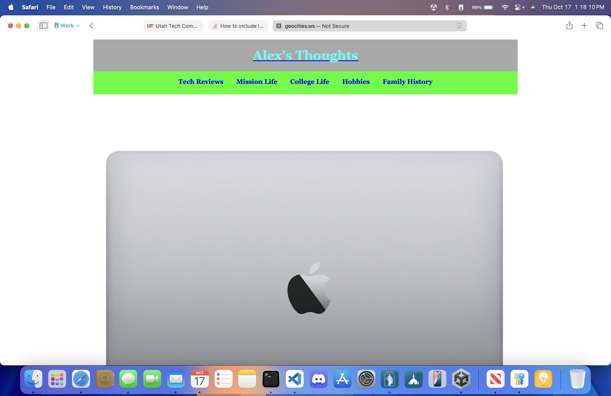
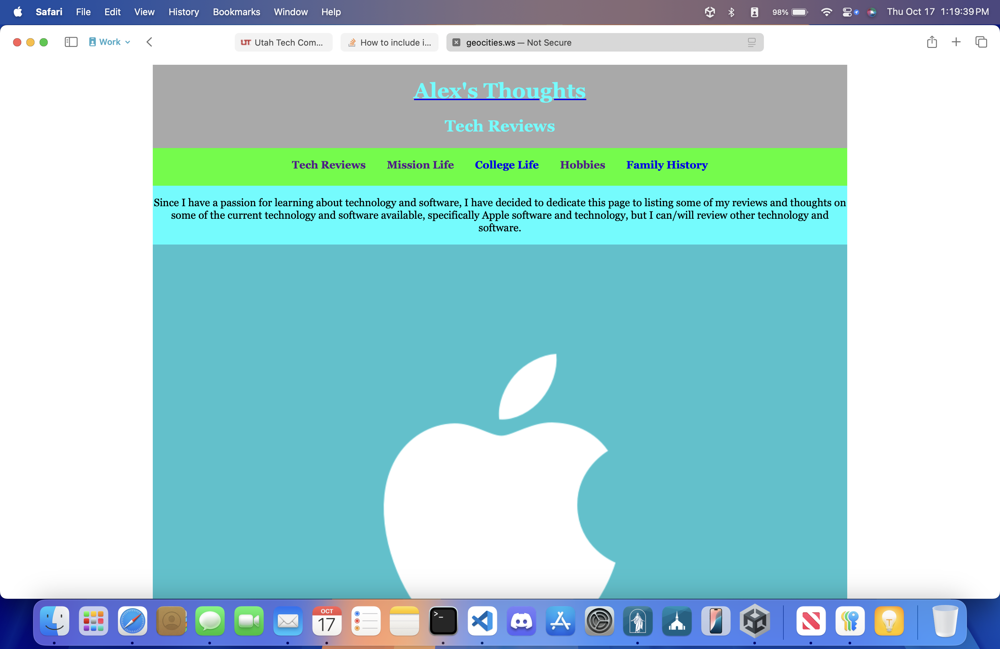

# Alex's Thoughts

This is my final project for my SE-1400 Web Design course at Utah Tech University.  This project is set up as a blog style personal review site.  I only used vanilla HTML and CSS with a CSS grid to wire up and style the site.

